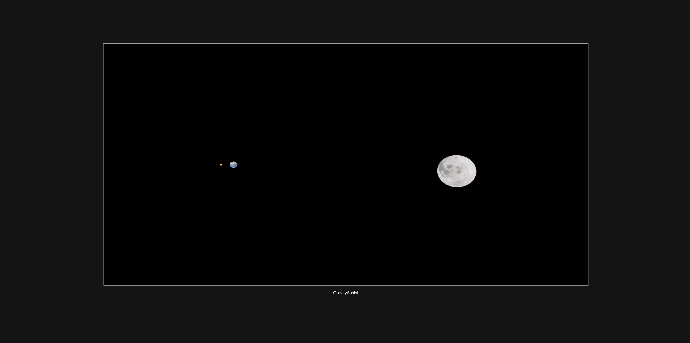

# Solar System Simulation

A 3D solar system simulation using **Three.js** that models the gravitational interactions between celestial bodies, allowing users to navigate and explore the system in real time. This project simulates the Sun, planets, and the Moon, including realistic orbits, masses, and velocities.

---

## Controls

| Key         | Action                                              |
|-------------|-----------------------------------------------------|
| `q`         | Move camera up.                                     |
| `w`         | Move camera closer.                                 |
| `e`         | Move camera down.                                   |
| `a`         | Move camera left.                                   |
| `s`         | Move camera further away.                           |
| `d`         | Move camera right.                                  |
| `ArrowUp`   | Rotate camera upward.                               |
| `ArrowDown` | Rotate camera downward.                             |
| `ArrowLeft` | Rotate camera left.                                 |
| `ArrowRight`| Rotate camera right.                                |
| `1-9`       | Teleport to celestial bodies (e.g., Mercury to Moon).|
| `0`         | Teleport to the Sun.                                |
| `-`         | Unlock camera.                                      |


---

## Installation

1. Clone the repository:
   ```bash
   git clone <repository_url>
   cd solar-system-simulation
   ```

2. Install dependencies:
   ```bash
   npm install
   ```

3. Run the application:
   ```bash
   npm start
   ```

---

## File Structure

```plaintext
.
├── textures/           # Texture files for planets and the Sun
├── main.js             # Core simulation logic
├── HeavenlyBodies.js   # Classes for celestial objects (Star, Planet, Moon)
├── index.html          # Entry point for the app
├── style.css           # Optional styling
└── README.md           # Project documentation
```

---

## Key Classes and Logic

### `HeavenlyBodies`
Defines base properties for all celestial objects:
- `name`, `radius`, `mass`, `position`, `velocity`, `sidereelTime`.

### `main.js`
- Initializes the scene, camera, and renderer.
- Adds celestial bodies with realistic masses, radii, and orbits.
- Calculates gravitational interactions in `gravityCalculation()`.

### Gravity Simulation
- Newtonian gravity is calculated using:
  \[
  F = \frac{G \cdot m_1 \cdot m_2}{r^2}
  \]
- Positions and velocities of bodies are updated iteratively.

---

## Screenshots


---

## Credits
[Solar System Textures](https://www.solarsystemscope.com/)